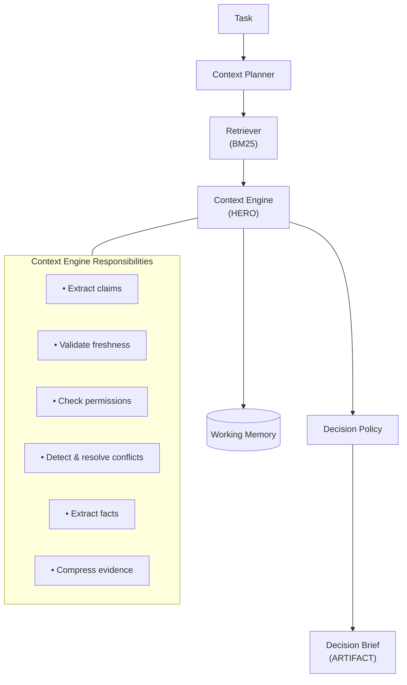

# Evidence Context Engine

A context layer that determines whether an AI agent has sufficient trusted evidence to complete a software engineering task autonomously.


## Quick Start

### Prerequisites
- Python 3.12+
- [uv](https://github.com/astral-sh/uv) package manager

### Setup & Run
```bash
# Install dependencies
uv sync

# Run demo (4 scenarios)
uv run python demo.py

# Run test suite (26 tests)
uv run pytest tests/ -v
```

**What to expect:**
- 4 demo scenarios demonstrating different failure modes
- 26/26 tests passing
- Decision Brief output for each scenario

## Problem & Solution

**Problem:** Autonomous AI agents fail when reasoning over raw retrieved context. They cannot determine whether retrieved information is sufficient, fresh, authorized, or consistent. This leads to:
- **False confidence**: Proceeding with incomplete/conflicting context
- **Unnecessary escalation**: Blocking on tasks where sufficient evidence exists

**Solution:** A context layer that sits between data sources and the agent. It retrieves candidate context, validates evidence (freshness, permissions, conflicts), compresses validated evidence into a Decision Brief, and provides only the Decision Brief to the agent—not raw documents.

**Core Thesis:** Agents should reason over validated evidence—not raw retrieved context.

## Architecture Overview



**Components:**
- **Context Planner**: Determines required context categories
- **Retriever**: BM25-based document retrieval
- **Context Engine** (Hero): Validates freshness, checks permissions, detects/resolves conflicts, extracts facts, compresses context
- **Working Memory**: Task-scoped fact storage
- **Decision Policy**: Explicit rules (no ML) for PROCEED/ESCALATE
- **Decision Brief**: Final artifact with validated evidence

## Context Engineering Principles

**Select**: The Retriever uses BM25 to match documents to required context categories. Only relevant documents are passed forward.

**Write**: Working Memory stores facts discovered during claim extraction. Facts are key-value pairs with source attribution, task-scoped and reset between tasks.

**Compress**: Raw documents → Claims → Validated Evidence → Decision Brief. The brief contains only what's retained, not what's rejected.

**Isolate**: Only the Decision Brief is passed to downstream agents. Raw documents, retrieval results, and validation reasoning are excluded.

## How It Works

### Decision Flow

**PROCEED when:**
- All required context categories have validated claims
- No unresolved conflicts
- All claims are fresh enough
- No permission violations

**ESCALATE when:**
- Missing required context
- Unresolved conflicts (equal authority)
- Stale evidence for required context
- Permission violations for required context

### Conflict Resolution

When conflicts exist, resolution uses authority levels:
1. Code (highest)
2. Security Policy
3. Architecture Docs
4. README
5. Meeting Notes (lowest)

Conflicts between equal-authority sources are unresolvable and require human review.

### Failure Modes

| Failure Mode | Mitigation |
|--------------|------------|
| Context Poisoning | Freshness validation rejects stale docs |
| Context Clash | Authority-based conflict resolution |
| Context Distraction | Retrieval + claim extraction reduces noise |
| Context Confusion | Priority rules + explicit policy |

## Demo Scenarios

All scenarios use the same task: "Add rate limiting to the /login endpoint"

| Scenario | Condition | Decision | Rule Fired |
|----------|-----------|----------|------------|
| 1 | All evidence present | PROCEED | Proceed Rule |
| 2 | Stale architecture doc | ESCALATE | Freshness Rule |
| 3 | Restricted security policy | ESCALATE | Permission Rule |
| 4 | Conflicting claims | ESCALATE | Conflict Rule |

**Detailed inputs/outputs:** See [`docs/VALIDATION.md`](docs/VALIDATION.md#sample-inputs-and-outputs)

## Validation

**Test Suite:** 26/26 tests passing  
**Decision Accuracy:** 4/4 scenarios correct  
**False Proceed Rate:** 0%  
**False Escalation Rate:** 0%  

**Detailed validation checklist:** See [`docs/VALIDATION.md`](docs/VALIDATION.md)

## Assumptions

- Repository size is small (<50 documents)
- Documents have timestamps (or timestamps can be inferred)
- Permissions are predefined in `permissions.json`
- One task per execution
- BM25 retrieval is sufficient for small corpus
- Conflict resolution by authority is acceptable (no ML needed)
- Claim extraction uses heuristic approach (no LLM required)

## Limitations

- One task per execution
- Working Memory resets between tasks
- BM25 retrieval (not suitable for large corpora)
- Context requirements are predefined
- Decision Brief is not consumed by an actual agent
- Context reduction metric below 80% target (see VALIDATION.md for explanation)

## Future Improvements

- Multi-agent integration (pass Decision Brief to actual agent)
- Persistent organizational memory (accumulate facts across tasks)
- Dynamic planning with LLMs (instead of rule-based context planning)
- Production retrieval pipeline (embeddings, vector search)
- Real-time updates as documents change
- LLM-based claim extraction (when API key is available)

## Documentation

- **[SPEC.md](docs/SPEC.md)**: Complete specification with all requirements
- **[AI_WORKFLOW.md](docs/AI_WORKFLOW.md)**: Multi-agent development workflow
- **[VALIDATION.md](docs/VALIDATION.md)**: Test results and metrics

## Project Structure

```
context-engine/
├── README.md
├── pyproject.toml
├── demo.py
├── docs/
│   ├── SPEC.md
│   ├── AI_WORKFLOW.md
│   └── VALIDATION.md
├── fixtures/
│   ├── scenario1/
│   ├── scenario2/
│   ├── scenario3/
│   └── scenario4/
├── context_engine/
│   ├── planner.py
│   ├── retriever.py
│   ├── engine.py
│   ├── working_memory.py
│   ├── policy.py
│   ├── brief.py
│   ├── loader.py
│   └── pipeline.py
├── schemas/
│   ├── task.py
│   ├── evidence.py
│   ├── working_memory.py
│   └── decision_brief.py
└── tests/
    ├── test_planner.py
    ├── test_retriever.py
    ├── test_engine.py
    ├── test_policy.py
    └── test_scenarios.py
```

## License

MIT
