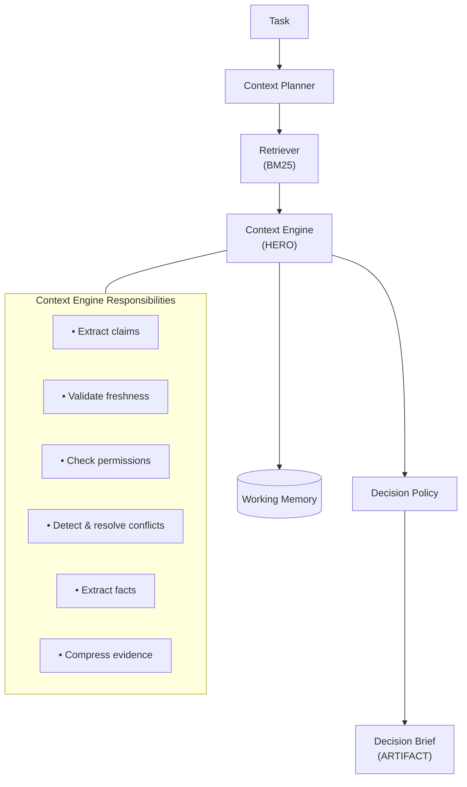

# Evidence Context Engine

A context layer that determines whether an AI agent has sufficient trusted evidence to complete a software engineering task autonomously.


## Problem

Autonomous AI agents fail when reasoning over raw retrieved context. They cannot determine whether retrieved information is sufficient, fresh, authorized, or consistent. This leads to two failure modes:
- **False confidence**: Proceeding with incomplete/conflicting context, producing incorrect implementations
- **Unnecessary escalation**: Blocking on tasks where sufficient evidence exists but hasn't been validated

The Evidence Context Engine solves this by sitting between data sources and the agent. It retrieves candidate context, validates evidence (freshness, permissions, conflicts), compresses validated evidence into a Decision Brief, and provides only the Decision Brief to the agent—not raw documents.

## Users

| User | Role |
|------|------|
| **AI coding agent** | Consumes the Decision Brief to decide whether to proceed or escalate |
| **Human reviewer** | Reviews the Decision Brief to understand why the agent proceeded or escalated |
| **Engineering platform** | Integrates the context engine into CI/CD or development workflows |

## Quick Start

### Prerequisites
- Python 3.12+
- [uv](https://github.com/astral-sh/uv) package manager

### Setup & Run
```bash
# Install dependencies
uv sync

# Run demo (4 scenarios)
uv run python demo.py

# Run test suite (26 tests)
uv run pytest tests/ -v
```

**What to expect:**
- 4 demo scenarios demonstrating different failure modes
- 26/26 tests passing
- Decision Brief output for each scenario

## Generalizability

While this prototype demonstrates the pattern with a single software engineering task (rate limiting) and code/documentation repositories, the architecture applies to any domain where agents need validated context:

- **Issue trackers**: Validate that bug reports have sufficient reproduction steps, logs, and environment details before autonomous triage
- **Calendars**: Check that meeting context (attendee list, agenda, prior notes) is complete and authorized before scheduling
- **Email systems**: Verify that email threads have full conversation history and attachments before drafting responses
- **Message platforms**: Ensure chat context includes relevant threads, user permissions, and message history before acting
- **Document repositories**: Validate that PDFs, contracts, or specifications are current, authorized, and internally consistent before extraction
- **User preferences**: Confirm that preference data is fresh, authorized, and doesn't conflict across sources before personalization

The core pattern—**retrieve → validate → compress → isolate**—is domain-agnostic. The Context Engine's validation rules (freshness thresholds, permission checks, conflict resolution) can be configured per domain, and the Decision Brief structure remains the same regardless of data type.

## Architecture Overview



**Components:**
- **Context Planner**: Determines required context categories
- **Retriever**: BM25-based document retrieval
- **Context Engine** (Hero): Validates freshness, checks permissions, detects/resolves conflicts, extracts facts, compresses context
- **Working Memory**: Task-scoped fact storage
- **Decision Policy**: Explicit rules (no ML) for PROCEED/ESCALATE
- **Decision Brief**: Final artifact with validated evidence

## Context Engineering Principles

**Select**: The Retriever uses BM25 to match documents to required context categories. Only relevant documents are passed forward.

**Write**: Working Memory stores facts discovered during claim extraction. Facts are key-value pairs with source attribution, task-scoped and reset between tasks.

**Compress**: Raw documents → Claims → Validated Evidence → Decision Brief. The brief contains only what's retained, not what's rejected.

**Isolate**: Only the Decision Brief is passed to downstream agents. Raw documents, retrieval results, and validation reasoning are excluded.

## How It Works

### Decision Flow

**PROCEED when:**
- All required context categories have validated claims
- No unresolved conflicts
- All claims are fresh enough
- No permission violations

**ESCALATE when:**
- Missing required context
- Unresolved conflicts (equal authority)
- Stale evidence for required context
- Permission violations for required context

### Conflict Resolution

When conflicts exist, resolution uses authority levels:
1. Code (highest)
2. Security Policy
3. Architecture Docs
4. README
5. Meeting Notes (lowest)

Conflicts between equal-authority sources are unresolvable and require human review.

### Failure Modes

| Failure Mode | Mitigation |
|--------------|------------|
| Context Poisoning | Freshness validation rejects stale docs |
| Context Clash | Authority-based conflict resolution |
| Context Distraction | Retrieval + claim extraction reduces noise |
| Context Confusion | Priority rules + explicit policy |

## Demo Scenarios

All scenarios use the same task: "Add rate limiting to the /login endpoint"

| Scenario | Condition | Decision | Rule Fired |
|----------|-----------|----------|------------|
| 1 | All evidence present | PROCEED | Proceed Rule |
| 2 | Stale architecture doc | ESCALATE | Freshness Rule |
| 3 | Restricted security policy | ESCALATE | Permission Rule |
| 4 | Conflicting claims | ESCALATE | Conflict Rule |

**Detailed inputs/outputs:** See [`docs/VALIDATION.md`](docs/VALIDATION.md#sample-inputs-and-outputs)

## Validation

**Test Suite:** 26/26 tests passing  
**Decision Accuracy:** 4/4 scenarios correct  
**False Proceed Rate:** 0%  
**False Escalation Rate:** 0%  

**Detailed validation checklist:** See [`docs/VALIDATION.md`](docs/VALIDATION.md)

## Assumptions

- Repository size is small (<50 documents)
- Documents have timestamps (or timestamps can be inferred)
- Permissions are predefined in `permissions.json`
- One task per execution
- BM25 retrieval is sufficient for small corpus
- Conflict resolution by authority is acceptable (no ML needed)
- Claim extraction uses heuristic approach (no LLM required)

## Limitations

- One task per execution
- Working Memory resets between tasks
- BM25 retrieval (not suitable for large corpora)
- Context requirements are predefined
- Decision Brief is not consumed by an actual agent
- Context reduction metric below 80% target (see VALIDATION.md for explanation)

## Tradeoffs, Risks, and Privacy Boundaries

### Tradeoffs

**BM25 vs. Embeddings for Retrieval**
We chose BM25 (lexical matching) over vector embeddings for simplicity and zero external dependencies. This works well for the demo's small corpus (<20 documents) but would not scale to production use cases requiring semantic search. For a production system, we'd use embeddings (e.g., sentence-transformers) with FAISS or a vector database.

**Heuristic vs. LLM-Based Claim Extraction**
The current implementation uses a heuristic line-splitting approach to extract claims from documents. This is deterministic, requires no API keys, and produces reproducible output for grading. A more sophisticated approach would use an LLM (e.g., GPT-4) with structured output to extract claims with higher semantic understanding. We chose the heuristic path to keep the demo self-contained and avoid requiring paid API keys. An LLM extraction path is noted as future work.

**Rule-Based vs. ML-Based Conflict Resolution**
Conflicts are resolved using explicit authority rules (Code > Security Policy > Architecture Docs > README > Meeting Notes). This is auditable and deterministic but less flexible than ML-based approaches that could learn from historical conflict patterns. For a production system, we might combine rule-based resolution with ML-based confidence scoring.

### Risks

**False PROCEED if Metadata is Wrong**
If a document's timestamp or permission metadata is incorrect at the source (e.g., a "Last updated" date is wrong), the freshness validation will use that incorrect metadata, potentially allowing stale claims through. The system trusts the metadata it receives.

**Narrow Conflict Detection**
The current conflict detection only identifies contradictions within the same `fact_key` (e.g., two documents disagreeing on `auth_mechanism`). Other types of conflicts (e.g., two documents proposing different rate limiting strategies without a shared fact key) would pass through undetected. This is a known limitation of the prototype.

**No Learning from Past Escalations**
Working Memory resets between tasks, so the system cannot learn from previous escalations. If the same task is run twice with the same missing evidence, it will escalate both times rather than accumulating organizational knowledge about what's needed.

### Privacy Boundaries

**Document-Level Access Control**
The system enforces privacy through an explicit allowlist/denylist in `permissions.json`. Restricted documents are never passed to claim extraction, and their absence is surfaced in the Decision Brief as `permission_violations` rather than silently degrading the evidence set.

**What This Does NOT Cover**
- **No redaction within allowed documents**: If a document is allowed, all its content is extracted. There is no field-level access control or PII redaction.
- **No audit logging**: The system does not log which documents were accessed or by whom. In a production system, this would be critical for compliance.
- **No encryption at rest**: Claims and evidence are stored in memory as plain Python objects. A production system would need encryption for sensitive organizational knowledge.

The privacy model is intentionally simple for the prototype: document-level allow/deny. This is sufficient to demonstrate the principle that the context layer must respect access control, but a production implementation would require more granular controls.

## Future Improvements

- Multi-agent integration (pass Decision Brief to actual agent)
- Persistent organizational memory (accumulate facts across tasks)
- Dynamic planning with LLMs (instead of rule-based context planning)
- Production retrieval pipeline (embeddings, vector search)
- Real-time updates as documents change
- LLM-based claim extraction (when API key is available)

## Documentation

- **[SPEC.md](docs/SPEC.md)**: Complete specification with all requirements
- **[AI_WORKFLOW.md](docs/AI_WORKFLOW.md)**: Multi-agent development workflow
- **[VALIDATION.md](docs/VALIDATION.md)**: Test results and metrics

## Project Structure

```
context-engine/
├── README.md
├── pyproject.toml
├── demo.py
├── docs/
│   ├── SPEC.md
│   ├── AI_WORKFLOW.md
│   └── VALIDATION.md
├── fixtures/
│   ├── scenario1/
│   ├── scenario2/
│   ├── scenario3/
│   └── scenario4/
├── context_engine/
│   ├── planner.py
│   ├── retriever.py
│   ├── engine.py
│   ├── working_memory.py
│   ├── policy.py
│   ├── brief.py
│   ├── loader.py
│   └── pipeline.py
├── schemas/
│   ├── task.py
│   ├── evidence.py
│   ├── working_memory.py
│   └── decision_brief.py
└── tests/
    ├── test_planner.py
    ├── test_retriever.py
    ├── test_engine.py
    ├── test_policy.py
    └── test_scenarios.py
```

## License

MIT
