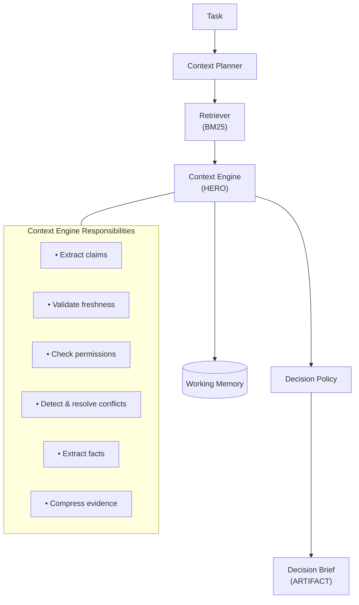

# Evidence Context Engine

A context layer that determines whether an AI agent has sufficient trusted evidence to complete a software engineering task autonomously.


## Problem

AI agents struggle when they reason over raw retrieved context. They can't tell if the information they have is sufficient, fresh enough, authorized, or even consistent. This creates two failure modes:
- **False confidence**: The agent proceeds with incomplete or conflicting context and produces incorrect implementations
- **Unnecessary escalation**: The agent blocks on tasks where sufficient evidence actually exists but hasn't been validated

The Evidence Context Engine fixes this by:
- Retrieving candidate context from data sources
- Validating evidence (checking freshness, permissions, and conflicts)
- Compressing validated evidence into a Decision Brief
- Giving only the Decision Brief to the agent—not raw documents

## Users

| User | Role |
|------|------|
| **AI coding agent** | Consumes the Decision Brief to decide whether to proceed or escalate |
| **Human reviewer** | Reviews the Decision Brief to understand why the agent proceeded or escalated |
| **Engineering platform** | Integrates the context engine into CI/CD or development workflows |

## Quick Start

### Prerequisites
- Python 3.12+
- [uv](https://github.com/astral-sh/uv) package manager

### Setup & Run
```bash
# Install dependencies
uv sync

# Run demo (4 scenarios)
uv run python demo.py

# Run test suite (26 tests)
uv run pytest tests/ -v
```

**What to expect:**
- 4 demo scenarios demonstrating different failure modes
- 26/26 tests passing
- Decision Brief output for each scenario

## Generalizability

This prototype tackles a single software engineering task (rate limiting) with code and documentation, but the pattern works anywhere agents need validated context:

- **Issue trackers**: Check bug reports for reproduction steps, logs, and environment details before autonomous triage
- **Calendars**: Verify meeting context (attendee list, agenda, prior notes) is complete and authorized before scheduling
- **Email systems**: Confirm email threads have full conversation history and attachments before drafting responses
- **Message platforms**: Validate chat context includes relevant threads, user permissions, and message history before acting
- **Document repositories**: Check PDFs, contracts, or specs are current, authorized, and internally consistent before extraction
- **User preferences**: Ensure preference data is fresh, authorized, and doesn't conflict across sources before personalization

The core pattern—**retrieve → validate → compress → isolate**—works across domains:
- Context Engine validation rules (freshness thresholds, permission checks, conflict resolution) adapt per domain
- Decision Brief structure stays the same regardless of data type

## Architecture Overview



**Components:**
- **Context Planner**: Determines required context categories
- **Retriever**: BM25-based document retrieval
- **Context Engine** (Hero): Validates freshness, checks permissions, detects/resolves conflicts, extracts facts, compresses context
- **Working Memory**: Task-scoped fact storage
- **Decision Policy**: Explicit rules (no ML) for PROCEED/ESCALATE
- **Decision Brief**: Final artifact with validated evidence

## Context Engineering Principles

- **Select**: Retriever uses BM25 to match documents to required context categories and passes only relevant documents forward
- **Write**: Working Memory stores facts discovered during claim extraction as key-value pairs with source attribution, scoped to the current task and reset between tasks
- **Compress**: System transforms raw documents → claims → validated evidence → Decision Brief, keeping only what's retained and discarding what's rejected
- **Isolate**: System passes only the Decision Brief to downstream agents and excludes raw documents, retrieval results, and validation reasoning

## How It Works

### Decision Flow

**PROCEED when:**
- All required context categories have validated claims
- No unresolved conflicts
- All claims are fresh enough
- No permission violations

**ESCALATE when:**
- Missing required context
- Unresolved conflicts (equal authority)
- Stale evidence for required context
- Permission violations for required context

### Conflict Resolution

Resolution uses authority levels when conflicts exist:
1. Code (highest)
2. Security Policy
3. Architecture Docs
4. README
5. Meeting Notes (lowest)

- Equal-authority source conflicts remain unresolvable and require human review

### Failure Modes

| Failure Mode | Mitigation |
|--------------|------------|
| Context Poisoning | Freshness validation rejects stale docs |
| Context Clash | Authority-based conflict resolution |
| Context Distraction | Retrieval + claim extraction reduces noise |
| Context Confusion | Priority rules + explicit policy |

## Demo Scenarios

All scenarios use the same task: "Add rate limiting to the /login endpoint"

| Scenario | Condition | Decision | Rule Fired |
|----------|-----------|----------|------------|
| 1 | All evidence present | PROCEED | Proceed Rule |
| 2 | Stale architecture doc | ESCALATE | Freshness Rule |
| 3 | Restricted security policy | ESCALATE | Permission Rule |
| 4 | Conflicting claims | ESCALATE | Conflict Rule |

**Detailed inputs/outputs:** See [`docs/VALIDATION.md`](docs/VALIDATION.md#sample-inputs-and-outputs)

## Validation

**Test Suite:** 26/26 tests passing  
**Decision Accuracy:** 4/4 scenarios correct  
**False Proceed Rate:** 0%  
**False Escalation Rate:** 0%  

**Detailed validation checklist:** See [`docs/VALIDATION.md`](docs/VALIDATION.md)

## Assumptions

- Repository size is small (<50 documents)
- Documents have timestamps (or timestamps can be inferred)
- Permissions are predefined in `permissions.json`
- One task per execution
- BM25 retrieval is sufficient for small corpus
- Conflict resolution by authority is acceptable (no ML needed)
- Claim extraction uses heuristic approach (no LLM required)

## Limitations

- One task per execution
- Working Memory resets between tasks
- BM25 retrieval (not suitable for large corpora)
- Context requirements are predefined
- Decision Brief is not consumed by an actual agent
- Context reduction metric below 80% target (see VALIDATION.md for explanation)

## Tradeoffs, Risks, and Privacy Boundaries

### Tradeoffs

**BM25 vs. Embeddings for Retrieval**
- Selected BM25 (lexical matching) over vector embeddings to keep the prototype simple and avoid external dependencies
- Works fine for the demo's small corpus (<20 documents)
- Wouldn't cut it in production where semantic search matters
- A real system would need embeddings (sentence-transformers) with FAISS or a vector database

**Heuristic vs. LLM-Based Claim Extraction**
- Uses a basic line-splitting heuristic to extract claims from documents
- Keeps things deterministic and avoids API key requirements for reproducibility during grading
- Claim extraction is pretty crude—it just looks for lines with certain patterns
- A production version would use an LLM with structured output to actually understand what's being said

**Rule-Based vs. ML-Based Conflict Resolution**
- Resolves conflicts through explicit authority rules (Code > Security Policy > Architecture Docs > README > Meeting Notes)
- Makes the logic transparent and debuggable, but rigid
- An ML approach could learn from past conflicts and handle edge cases better
- You'd lose the ability to explain why a particular conflict was resolved a certain way

### Risks

**Garbage In, Garbage Out**
- System trusts document timestamp or permission metadata as-is
- A stale "Last updated" date or incorrect permission flag lets bad evidence through or blocks good evidence
- System has no way to verify metadata accuracy—it just uses what it's given

**Limited Conflict Detection**
- System only catches contradictions when two claims share the same `fact_key` (like two docs disagreeing on `auth_mechanism`)
- If two documents propose different approaches without overlapping on a fact key, the conflict slips through undetected
- This is a real limitation, not just a prototype shortcut

**No Institutional Memory**
- Working Memory gets wiped between tasks
- System never learns from past escalations
- Run the same task twice with the same missing evidence, and you'll get the same escalation both times
- No accumulation of organizational knowledge about what context is typically needed

### Privacy Boundaries

**Document-Level Access Control**
- Enforces privacy through an explicit allowlist/denylist in `permissions.json`
- Restricted documents never reach the claim extraction stage
- When documents get blocked, the Decision Brief surfaces this as `permission_violations` instead of silently working with less evidence

**What's Not Covered**
- **No field-level redaction**: If a document is allowed, the entire thing gets extracted. No PII filtering, no sensitive field masking.
- **No audit trail**: There's no logging of which documents were accessed or by whom. Production systems need this for compliance.
- **No encryption**: Claims and evidence live in memory as plain Python objects. A real system would encrypt sensitive organizational knowledge at rest.

**Privacy Model**
- Deliberately basic—just document-level allow/deny
- Demonstrates that the context layer respects access control
- Production use requires much more sophisticated controls

## Future Improvements

- Multi-agent integration (pass Decision Brief to actual agent)
- Persistent organizational memory (accumulate facts across tasks)
- Dynamic planning with LLMs (instead of rule-based context planning)
- Production retrieval pipeline (embeddings, vector search)
- Real-time updates as documents change
- LLM-based claim extraction (when API key is available)

## Documentation

- **[SPEC.md](docs/SPEC.md)**: Complete specification with all requirements
- **[AI_WORKFLOW.md](docs/AI_WORKFLOW.md)**: Multi-agent development workflow
- **[VALIDATION.md](docs/VALIDATION.md)**: Test results and metrics

## Project Structure

```
context-engine/
├── README.md
├── pyproject.toml
├── demo.py
├── docs/
│   ├── SPEC.md
│   ├── AI_WORKFLOW.md
│   └── VALIDATION.md
├── fixtures/
│   ├── scenario1/
│   ├── scenario2/
│   ├── scenario3/
│   └── scenario4/
├── context_engine/
│   ├── planner.py
│   ├── retriever.py
│   ├── engine.py
│   ├── working_memory.py
│   ├── policy.py
│   ├── brief.py
│   ├── loader.py
│   └── pipeline.py
├── schemas/
│   ├── task.py
│   ├── evidence.py
│   ├── working_memory.py
│   └── decision_brief.py
└── tests/
    ├── test_planner.py
    ├── test_retriever.py
    ├── test_engine.py
    ├── test_policy.py
    └── test_scenarios.py
```

## License

MIT
